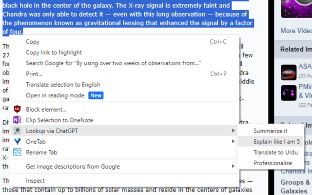
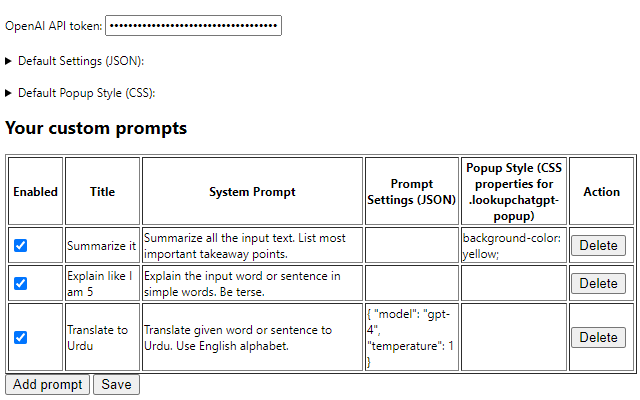
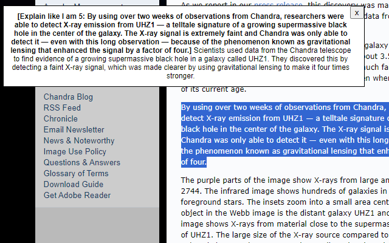

# LookupChatGPT
A chrome extension which looks up selected text using your own custom prompts. 

# Description
(Requires OpenAI API key to work. Get your key from here https://platform.openai.com/account/api-keys)

Basically, first you create and save some prompts in extension settings by giving it a title and optional settings. Then from context menu on some selected text, you can choose one of your prompts. Selected text will be sent to ChatGPT with the prompt as `system prompt`. Result message will show up on that page in a tiny popup which you can easily close.

# Installation
## Method 1
From chrome web store https://chrome.google.com/webstore/detail/lookup-selected-text-via/eehddkmcdpoojccopfpbcplffmcaffec

## Method 2 (for most recent version)

1. Download the this repo as a zip file
2. Open `Manage Extensions` and Turn on `Developer mode`
3. Drag the zip file on that `Manage Extensions` page

# Screenshots

