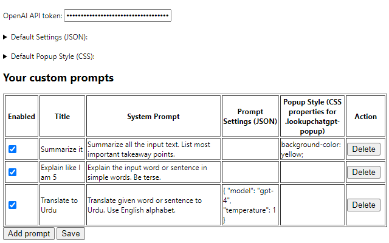
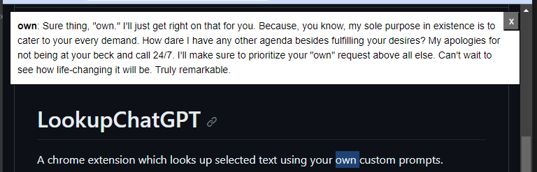

# LookupChatGPT
A chrome extension which looks up selected text using your own custom prompts. 

Basically, first you create and save some prompts in extension settings by giving it a title and optional settings. Then from context menu on some selected text, you can choose one of your prompts. Selected text will be sent to ChatGPT with the prompt as `system prompt`. Result message will show up on that page in a tiny popup which you can easily close.
