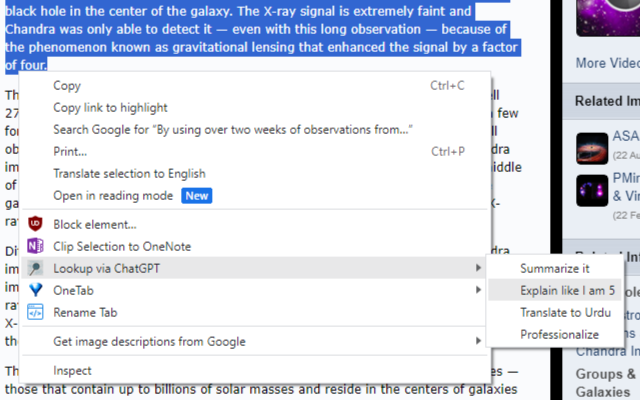
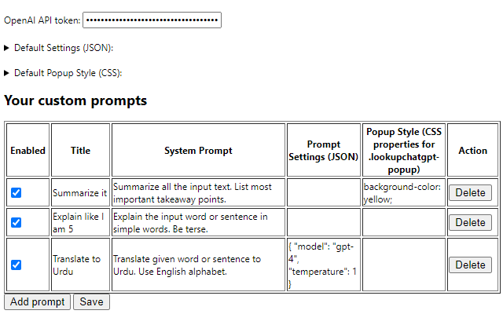

# LookupChatGPT
A chrome extension which looks up selected text using your own custom prompts. 

# Description
(Requires an API key to work. Pick one provider and put its key in the settings)
- OpenAI https://platform.openai.com/account/api-keys
- Anthropic https://console.anthropic.com/settings/keys
- Google Gemini https://aistudio.google.com/app/apikey
- OpenRouter https://openrouter.ai/settings/keys

Basically, first you create and save some prompts in extension settings by giving it a title and optional settings. Then from context menu on some selected text, you can choose one of your prompts. Selected text will be sent to the model with the prompt as `system prompt`. Result message will show up on that page in a tiny popup which you can easily close.

Other ways to run a prompt: the toolbar button, and an optional floating button that shows up next to selected text (off by default, turn it on in settings).

# Installation
## Method 1
From chrome web store https://chrome.google.com/webstore/detail/lookup-selected-text-via/eehddkmcdpoojccopfpbcplffmcaffec

## Method 2 (for most recent version)

1. Download `lookupchatgpt-chrome-<version>.zip` from https://github.com/SMUsamaShah/LookupChatGPT/releases
2. Open `Manage Extensions` and Turn on `Developer mode`
3. Drag the zip file on that `Manage Extensions` page

## Firefox
Download `lookupchatgpt-firefox-<version>.zip` from the same releases page.

# Screenshots

